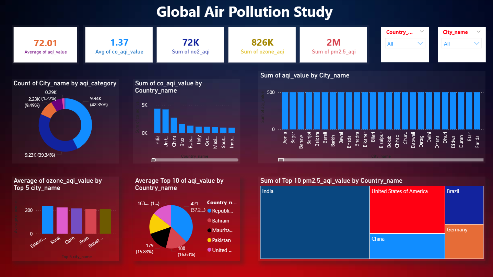

# Global Air Pollution Study (Power BI Analysis)

This project presents a comprehensive analysis of global air quality using **Power BI**. The dashboard visualizes key pollutants and Air Quality Index (AQI) levels to identify environmental hotspots and provide data-driven insights into global pollution trends.

## Dashboard Preview

## Project Objective
The primary goal of this study is to monitor and analyze the concentration of various pollutants across different countries and cities. Key focus areas include:
* **AQI Monitoring:** Tracking the Average and Sum of AQI values.
* **Pollutant Breakdown:** Visualizing specific levels of $Co$, $ozone$, $No_2$, and $Pm_{2.5}$.
* **Geographical Hotspots:** Identifying top polluted countries and cities for targeted environmental policy-making.

## Key Insights & Metrics
Based on the dashboard analysis:
* **Global Average AQI:** The average AQI value recorded is **72.01**.
* **High-Risk Pollutants:** $PM_{2.5}$ shows a massive cumulative value of **2 Million**, indicating it as a primary pollutant of concern.
* **Pollutant Concentration:** Other significant pollutants include ozone (**826K**) and $No_2$ (**72K**).
* **City-Level Distribution:** The bar chart reveals specific cities with AQI values exceeding **500**, which falls under the 'Hazardous' category.
* **AQI Categorization:** Approximately **42.35%** of the data points fall into specific high-pollution categories, as shown in the AQI Category Donut Chart.

## Tech Stack & Features
* **Visualization Tool:** Microsoft Power BI
* **Data Transformation:** Power Query for cleaning and structuring pollution data.
* **Key Visuals:**
    * **KPI Cards:** For real-time tracking of average/total pollutant levels.
    * **Treemaps & Bar Charts:** To visualize the Top 10 polluted countries (e.g., India, USA, China).
    * **Donut Charts:** For percentage distribution of AQI categories.
    * **Interactive Slicers:** Allows users to filter data by **Country Name** and **City Name**.

## 📂 Project Structure
* `/images`: Contains the high-resolution dashboard screenshot.
* `Global_air_pollution_dashboard.pbix`: The original Power BI file for interactive exploration.
* `Global_Air_Pollution_Study.pdf`: A static export of the dashboard for quick viewing.

## How to View
1. **Interactive:** Download the `.pbix` file and open it with **Power BI Desktop**.
2. **Static:** View the `Global_Air_Pollution_Study.pdf` or refer to the screenshot in the Preview section.
